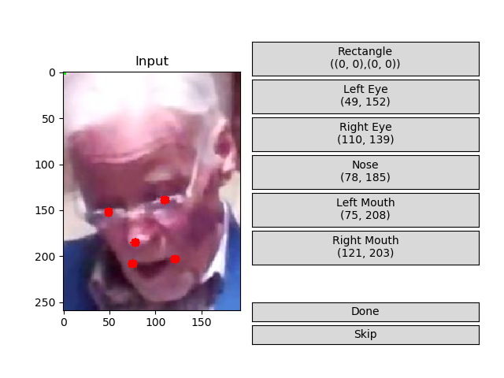

# Faces Annotation Tool

It is a very simple GUI facial landmark annotation tool using Matplotlib and OpenCV.

This version helps you manually annotate a bounding box and 5 points: left eye center, right eye center, nose tip, 
leftmost mouth point, rightmost mouth point. 

## How to use

To run this demo:

```python
 python annotate_faces.py -d ./demo/
```

## GUI



- Click the item and then click the corresponding point with your mouse to input coordinates. If you're unsatisfied about current coordinates, you can click as many times as you want until you feel OK

- Re-click the item to clean out the current coordinates

- Done: finish with current image

- Skip: skip current image

You can run the script for a single image or multiple images in a directory. Points are output to terminal in csv format, and save at the script's location as txt where landmarks are splitted by tab space.

Sample output:
```
./demo/1.jpg	49	152	110	139	78	185	75	208	121	203
```

## Reference

[annotate-faces](https://github.com/waldr/annotate-faces)